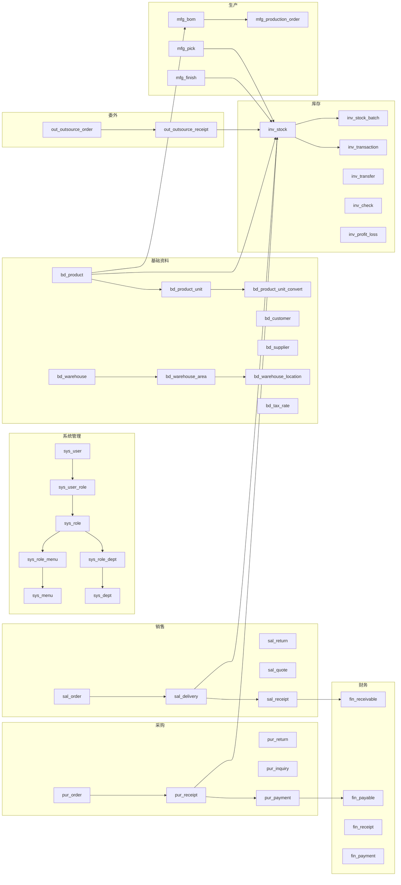

# 企业级工业进销存 ERP 系统 — 开发文档（总纲）

> **版本**：v1.0  
> **适用行业**：薄膜、塑料、五金、加工、工贸一体  
> **文档定位**：项目总纲，覆盖架构、数据库、业务、接口、前后端、桌面、App、部署、安全与开发规范，作为后续所有代码、SQL、测试、部署输出的统一依据。

---

## 目录

1. 项目概述
2. 整体架构与技术栈
3. 业务模块全景
4. 数据库设计（ER 图说明）
5. 公共字段与命名规范
6. 关键业务逻辑
7. 接口设计规范
8. 权限与数据安全
9. PC 后台设计
10. Electron 桌面端设计
11. 移动 App 设计
12. 性能与高并发
13. 部署方案
14. 开发规范
15. 交付清单与里程碑

---

## 一、项目概述

### 1.1 项目定位
面向薄膜、塑料、五金、加工、工贸一体企业的**进销存 + 生产 + 财务**一体化 ERP，参考美萍/管家通的操作体验，借鉴薄膜云 ERP 的行业特性，支持：

- 多终端：**PC 管理后台 + Windows 桌面客户端 + Android/iOS App**
- 多业务：采购、销售、库存、生产、委外、财务、报表
- 多单位：卷、米、公斤、张、件、千克，自动换算
- 多税率：含税/不含税自动换算
- 多级价格：批发/零售/大客户
- 多仓库：仓库-库区-库位三级

### 1.2 设计原则
- **企业级**：高稳定、高并发、可商用
- **前后端分离**：RESTful 接口 + 统一返回
- **行业适配**：薄膜分切/复卷/裁切、米重换算、BOM 主辅料损耗
- **代码复用**：PC、Electron、App 共用同一套 Vue3 业务组件

### 1.3 终端矩阵

| 终端 | 技术栈 | 用途 |
|------|--------|------|
| PC 管理后台 | Vue3 + Vite + Element Plus | 完整业务管理、报表、配置 |
| Windows 桌面客户端 | Electron + Vue3（复用 PC） | 本地高速打印、离线开单、快捷键 |
| Android App | uni-app + Vue3 | 外勤开单、扫码、查库存 |
| iOS App | uni-app + Vue3 | 同上 |

---

## 二、整体架构与技术栈

### 2.1 分层架构

```
┌─────────────────────────────────────────────┐
│  表现层  PC (Vue3+Element Plus) / Electron / App (uni-app) │
├─────────────────────────────────────────────┤
│  网关层  Nginx (反向代理 / 负载均衡 / 静态资源)            │
├─────────────────────────────────────────────┤
│  应用层  SpringBoot 3.x + Sa-Token + MyBatis-Plus        │
│         - Controller / Service / Mapper                   │
│         - Redis 缓存 / 分布式锁                            │
│         - 全局异常 / 统一返回 / 操作日志                   │
├─────────────────────────────────────────────┤
│  数据层  MySQL 8.0 (主从) / Redis 7.x /  MinIO(附件可选)   │
└─────────────────────────────────────────────┘
```

### 2.2 后端技术栈

| 组件 | 版本 | 用途 |
|------|------|------|
| SpringBoot | 3.2.x | 基础框架 |
| MyBatis-Plus | 3.5.x | ORM + 分页 + 逻辑删除 |
| Sa-Token | 1.37.x | 登录鉴权、权限、租户 |
| Redis | 7.x | 缓存、分布式锁、限流 |
| Druid | 1.2.x | JDBC 连接池 + 监控 |
| Hutool | 5.8.x | 工具集 |
| EasyExcel | 3.3.x | 导入导出 |
| JasperReports/LibreOffice | 6.x | 报表/PDF |
| MapStruct | 1.5.x | DTO/VO 转换 |
| Maven | 3.9.x | 构建 |

### 2.3 前端技术栈

| 端 | 技术 |
|----|------|
| PC | Vue3 + Vite + Element Plus + Pinia + Vue Router + Axios + ECharts |
| Electron | Electron 27 + Vue3（代码 100% 复用 PC）+ electron-builder |
| App | uni-app x / Vue3 + uView Plus（兼容 Android/iOS/微信小程序） |

---

## 三、业务模块全景

```
erp-system
├── 1.系统管理 sys
│   ├── 用户 / 部门 / 角色 / 菜单
│   ├── 按钮权限 / 数据权限
│   ├── 操作日志 / 登录日志
│   ├── 字典 / 系统配置
│   ├── 打印模板 / 编号规则
│   └── 数据备份与恢复
├── 2.基础资料 base
│   ├── 商品(含规格/型号/材质/厚度/幅宽/密度/色号/批次)
│   ├── 多单位 + 换算
│   ├── 客户 / 供应商 / 税率 / 价格等级
│   └── 仓库 / 库区 / 库位
├── 3.采购管理 pur
│   ├── 询价 / 订单 / 入库 / 退货
│   ├── 应付对账
│   └── 预付 / 货到付款 / 票到付款
├── 4.销售管理 sal
│   ├── 报价 / 订单 / 出库 / 退货
│   ├── 客户信用额度
│   └── 预收 / 抹零 / 整单折扣
├── 5.库存管理 inv (核心)
│   ├── 入库 / 出库 / 调拨 / 移位 / 盘点 / 盈亏
│   ├── 批次 / 生产日期 / 有效期 / 序列号
│   ├── 库存台账 / 预警
│   └── 薄膜分切 / 复卷 / 裁切 / 米重换算
├── 6.生产管理 mfg
│   ├── BOM (主料/辅料/损耗率)
│   ├── 加工单 / 领料 / 补料 / 退料
│   ├── 工序记录 / 成品入库
│   └── 成本归集
├── 7.委外加工 out
│   ├── 发料 / 入库
│   └── 加工费结算
├── 8.财务往来 fin
│   ├── 应收 / 应付 / 其他应收应付
│   ├── 收款 / 付款 / 转账
│   ├── 预收 / 预付
│   └── 往来对账 / 应收应付预警 / 毛利
├── 9.报表中心 rpt
│   ├── 销售明细 / 排行 / 汇总
│   ├── 库存明细 / 汇总 / 呆滞
│   ├── 应收应付台账 / 收支明细 / 经营报表
│   └── 数据大屏 / 日月年统计
└── 10.打印与导出 prt
    ├── 入库单 / 出库单 / 送货单 / 对账单 / 盘点单
    ├── 自定义模板 / 针式 / 小票
    └── Excel / PDF 批量导出
```

---

## 四、数据库设计（ER 图说明）

### 4.1 模块关系图（Mermaid）



### 4.2 核心实体关系

1. **商品 ↔ 单位**：`bd_product` 1—N `bd_product_unit`，`bd_product_unit_convert` 维护单位之间的换算因子（含薄膜的 `米重` 公式）。
2. **商品 ↔ 库存**：`bd_product` 1—N `inv_stock`（按仓库聚合），`inv_stock_batch` 保存批次维度。
3. **采购链路**：`pur_order` → `pur_receipt` → `pur_payment` → `fin_payable`，退货走 `pur_return`，询价 `pur_inquiry`。
4. **销售链路**：`sal_order` → `sal_delivery` → `sal_receipt` → `fin_receivable`，退货走 `sal_return`，报价 `sal_quote`。
5. **生产链路**：`mfg_bom` 展开 → `mfg_production_order` → `mfg_pick`（出库） / `mfg_finish`（入库） → `inv_stock`。
6. **委外链路**：`out_outsource_order`（发料） → `out_outsource_receipt`（入库） + `out_processing_fee`。
7. **库存流水**：所有出入库、调拨、盘点、盈亏都写入 `inv_transaction`，作为溯源主表。
8. **权限链路**：`sys_user` M—N `sys_role` M—N `sys_menu`，`sys_role` M—N `sys_dept`（数据范围）。

### 4.3 核心表清单（按模块）

| 模块 | 表前缀 | 主要表 | 说明 |
|------|--------|--------|------|
| 系统 | `sys_` | user, role, menu, dept, user_role, role_menu, role_dept, dict, config, log_login, log_operation, print_template, id_rule | 权限、日志、配置 |
| 基础 | `bd_` | product, product_unit, product_unit_convert, product_batch, customer, supplier, tax_rate, price_level, warehouse, warehouse_area, warehouse_location | 基础资料 |
| 采购 | `pur_` | order, order_item, receipt, receipt_item, return_order, return_item, inquiry, inquiry_item, payment, supplier_reconcile | 采购全流程 |
| 销售 | `sal_` | order, order_item, delivery, delivery_item, return_order, return_item, quote, quote_item, receipt, customer_reconcile | 销售全流程 |
| 库存 | `inv_` | stock, stock_batch, transaction, transfer, transfer_item, move, move_item, check, check_item, profit_loss, profit_loss_item, warning, split_log | 库存核心 |
| 生产 | `mfg_` | bom, bom_item, production_order, production_order_item, pick, pick_item, feed, feed_item, return_order, return_item, finish, finish_item, process, cost | 生产核心 |
| 委外 | `out_` | outsource_order, outsource_order_item, outsource_receipt, outsource_receipt_item, processing_fee, supplier | 委外加工 |
| 财务 | `fin_` | receivable, payable, receipt, payment, transfer, pre_receipt, pre_payment, reconcile, arap_log, profit | 往来与毛利 |
| 报表 | `rpt_` | snapshot_sales, snapshot_inventory, snapshot_arap | 报表快照 |
| 通用 | `gen_` | attach, audit_log, sequence | 通用 |

> 完整 DDL 见 `sql/01-schema.sql`、`sql/02-seed.sql`。

### 4.4 索引策略
- **所有主键** `BIGINT UNSIGNED AUTO_INCREMENT`
- **业务唯一键**：`uk_<table>_<biz>`，如 `uk_pur_order_no`
- **高频查询**：`idx_<table>_<col>`，如 `idx_inv_stock_product_id`
- **时间范围**：`idx_<table>_create_time`
- **多租户/数据权限**：`idx_<table>_dept_id`
- **软删除**：`idx_<table>_deleted`

### 4.5 软删除
所有业务表统一字段 `deleted TINYINT DEFAULT 0`，MyBatis-Plus `@TableLogic`。

### 4.6 公共字段（BaseEntity）

| 字段 | 类型 | 说明 |
|------|------|------|
| `id` | BIGINT UNSIGNED PK | 主键 |
| `create_by` | VARCHAR(64) | 创建人 |
| `create_time` | DATETIME | 创建时间 |
| `update_by` | VARCHAR(64) | 更新人 |
| `update_time` | DATETIME | 更新时间 |
| `deleted` | TINYINT | 逻辑删除 |
| `tenant_id` | BIGINT | 多租户预留 |
| `remark` | VARCHAR(500) | 备注 |

---

## 五、关键业务逻辑

### 5.1 库存并发控制（防超卖/重复出库）
- 使用 **Redis 分布式锁** `inv:lock:product:{productId}:{warehouseId}`，TTL 30s
- 数据库行级悲观锁兜底：`SELECT ... FOR UPDATE`
- 严格事务：单据保存 → 写流水 `inv_transaction` → 更新 `inv_stock` / `inv_stock_batch` → 删除缓存
- 出库前校验 `available_qty >= qty`，违反则抛出 `BizException("库存不足，禁止负库存出库")`

### 5.2 移动加权平均成本
```
新成本单价 = (当前库存金额 + 本次入库金额) / (当前库存数量 + 本次入库数量)
```
- 入库时（采购入库、成品入库、盘盈）触发成本计算
- 出库时按当前成本单价计算成本
- 每次出入库写入 `inv_transaction` 中保留 `unit_cost` 和 `total_cost`

### 5.3 薄膜行业特性
- **米重公式**：`m_per_kg = 1000 / (厚度mm × 幅宽mm × 密度g/cm³ × 0.001)` 或产品档案中维护换算系数
- **分切**：原卷 → N 个分切卷，自动扣减原卷库存、增加分切后库存
- **复卷**：小卷 → 大卷
- **裁切**：按米数/张数裁切
- 全部以 `inv_split_log` 留痕

### 5.4 BOM 展开与领料
- `mfg_bom` 树形结构，支持多层
- 加工单下推领料单时按 **BOM 单耗 × 加工数量 + 损耗率** 计算应领量
- 支持替代料、辅料的损耗率独立计算
- 实际领料 / 退料 / 补料形成完整链路

### 5.5 应收应付自动联动
- **入库即应付**：采购入库审核 → 自动生成 `fin_payable`
- **出库即应收**：销售出库审核 → 自动生成 `fin_receivable`
- **收款 / 付款** 冲销应收应付
- 客户信用额度 = 应收余额上限；超出禁止开单

### 5.6 单据编号规则
- 通用格式：`{前缀}{yyyyMMdd}{4位流水}`，例 `PO202606160001`
- 编号规则在 `sys_id_rule` 配置，支持按单据类型前缀、日期格式、流水位数自定义
- 流水用 Redis `INCR` 原子生成

### 5.7 价格与税
- 多级售价：批发价 / 零售价 / 大客户价
- 含税/不含税自动换算：`含税价 = 不含税价 × (1 + 税率)`
- 单据保存时同时记录 `tax_rate`、`price_incl_tax`、`price_excl_tax`、`tax_amount`

---

## 六、接口设计规范

### 6.1 RESTful 规范

| 操作 | HTTP | 路径 |
|------|------|------|
| 列表 | GET | `/api/{module}/{resource}` |
| 详情 | GET | `/api/{module}/{resource}/{id}` |
| 新增 | POST | `/api/{module}/{resource}` |
| 修改 | PUT | `/api/{module}/{resource}/{id}` |
| 删除 | DELETE | `/api/{module}/{resource}/{id}` |
| 审核 | POST | `/api/{module}/{resource}/{id}/audit` |
| 反审核 | POST | `/api/{module}/{resource}/{id}/unaudit` |
| 导出 | GET | `/api/{module}/{resource}/export` |

### 6.2 统一返回 `R<T>`

```json
{
  "code": 200,
  "msg": "ok",
  "data": { ... },
  "traceId": "abc123"
}
```

- `code`：200 成功；4xx 业务错误；5xx 系统错误
- 业务异常返回 `code=400, msg=库存不足`

### 6.3 分页参数
`pageNum`、`pageSize`、`keyword`、`orderBy`、`startTime`、`endTime`

### 6.4 全局异常处理
- `@RestControllerAdvice` 统一捕获
- 业务异常 `BizException`
- 鉴权异常 `NotLoginException` → 401
- 权限异常 `NotPermissionException` → 403
- 校验异常 `MethodArgumentNotValidException` → 400
- 兜底 `Exception` → 500，隐藏内部错误

### 6.5 鉴权
- Sa-Token 登录：`POST /api/auth/login` 返回 token
- 注解鉴权：`@SaCheckPermission("order:create")`、`@SaCheckRole("admin")`
- 数据范围：自定义注解 `@DataScope(deptAlias = "o")` 拦截 SQL 注入 dept_id 条件

---

## 七、权限与数据安全

### 7.1 菜单权限
- 树形菜单 `sys_menu`，类型：目录 / 菜单 / 按钮
- 按钮权限编码：`module:action`，例 `pur:order:create`

### 7.2 按钮权限
前端用 `v-permission="'pur:order:create'"` 控制按钮显隐，后端注解鉴权兜底。

### 7.3 数据权限
支持 5 级：
1. 全部 `ALL`
2. 本部门及下级 `DEPT_AND_CHILD`
3. 本部门 `DEPT`
4. 本人 `SELF`
5. 自定义 `CUSTOM`

通过 `sys_role_dept` 关联部门实现。

### 7.4 操作日志
- 注解 `@OperationLog("新增采购订单")` 自动记录
- AOP 拦截，异步写入 `sys_log_operation`

### 7.5 登录日志
记录 IP、UA、登录结果、地理位置；同一账号连续失败 5 次锁定 30 分钟。

---

## 八、PC 后台设计

### 8.1 目录结构

```
pc-web/
├── public/
├── src/
│   ├── api/                  # axios 封装 + 各模块接口
│   │   ├── system/
│   │   ├── base/
│   │   ├── purchase/
│   │   └── ...
│   ├── router/               # 路由
│   ├── store/                # Pinia
│   ├── layouts/              # Layout 组件
│   ├── components/           # 通用组件
│   │   ├── TablePro/         # 通用表格(筛选/排序/分页/合计/导出)
│   │   ├── FormPro/          # 通用表单
│   │   ├── DictTag/          # 字典标签
│   │   └── PrintBar/         # 打印条
│   ├── views/                # 业务页面
│   │   ├── dashboard/
│   │   ├── system/{user,role,menu,dept,dict,config,log,...}
│   │   ├── base/{product,customer,supplier,warehouse,...}
│   │   ├── purchase/{order,receipt,return,...}
│   │   ├── sales/{...}
│   │   ├── inventory/{...}
│   │   ├── production/{...}
│   │   ├── outsource/
│   │   ├── finance/{...}
│   │   ├── report/
│   │   └── print/
│   ├── utils/
│   ├── styles/
│   └── main.ts
├── index.html
├── vite.config.ts
└── package.json
```

### 8.2 路由
- 静态路由：登录、404
- 动态路由：登录后根据 `sys_menu` 生成，前端 meta 携带 `permission`、`title`、`icon`

### 8.3 状态管理
- `useUserStore`：用户信息、token、权限
- `useDictStore`：字典（缓存到 localStorage）
- `useAppStore`：侧边栏、主题

### 8.4 通用组件
- `TablePro`：列配置、筛选、排序、分页、合计行、Excel 导出、行选择
- `FormPro`：动态渲染、支持 v-model
- `DictTag`：字典回显
- `PrintBar`：打印按钮 + 模板选择

---

## 九、Electron 桌面端设计

### 9.1 架构
```
electron/
├── src/
│   ├── main/                 # 主进程
│   │   ├── index.ts          # 入口
│   │   ├── window.ts         # 窗口管理
│   │   ├── print.ts          # 本地打印
│   │   ├── shortcut.ts       # 快捷键
│   │   ├── autostart.ts      # 开机自启
│   │   └── ipc.ts            # IPC 通信
│   ├── preload/              # 预加载
│   │   └── preload.ts
│   └── renderer/             # 渲染进程(同 PC 业务代码)
├── build/                    # 打包配置
└── package.json
```

### 9.2 关键能力
- **本地高速打印**：调用系统打印机（针式/小票），支持静默打印、连续纸
- **离线开单**：IndexedDB 暂存单据，恢复网络后自动同步
- **快捷键**：`F1` 新增、`F2` 保存、`F4` 打印、`Esc` 退出
- **开机自启**：`app.setLoginItemSettings({ openAtLogin: true })`
- **全局快捷键**：`globalShortcut` 注册开单窗口

### 9.3 打包
`electron-builder` 配置 `nsis`（Windows 安装包）、`appx`（可选）、自动升级。

---

## 十、移动 App 设计（uni-app Vue3）

### 10.1 页面结构

```
app/
├── src/
│   ├── pages/
│   │   ├── login/login.vue
│   │   ├── dashboard/home.vue
│   │   ├── inventory/{query,detail,transfer,check}.vue
│   │   ├── sales/{quickOrder,order,delivery,return}.vue
│   │   ├── purchase/{order,receipt}.vue
│   │   ├── scan/{scanIn,scanOut,scanQuery}.vue
│   │   ├── report/{sales,inventory}.vue
│   │   ├── finance/{receivable,payable,collect}.vue
│   │   └── profile/{profile,setting,about}.vue
│   ├── components/   # 复用组件
│   ├── api/          # 接口
│   ├── store/        # Pinia
│   ├── utils/        # 工具
│   ├── static/       # 静态资源
│   ├── App.vue
│   ├── main.ts
│   └── pages.json
├── manifest.json     # uni-app 配置
├── pages.json
└── package.json
```

### 10.2 关键能力
- **扫码出入库**：`uni.scanCode`
- **库存预警推送**：WebSocket / 极光推送
- **客户下单**：移动端选商品 → 生成销售订单
- **外勤盘点**：离线缓存盘点数据，回公司上传
- **物流查看**：对接快递 100 / 顺丰接口

### 10.3 跨端
- Android：HBuilderX 云打包 / 本地打包
- iOS：HBuilderX 云打包（需 Apple 开发者账号）
- 微信小程序：同一套代码可发布微信小程序（生态接入）

---

## 十一、性能与高并发

### 11.1 缓存
- **字典 / 配置**：Redis Hash，启动加载
- **用户权限**：登录后写入 Redis，TTL 30 分钟
- **库存数量**：Redis 缓存，库存变更时删除，主动加载
- **热点报表**：Redis 缓存 5 分钟

### 11.2 数据库优化
- 索引：单表不超过 6 个索引
- 大表分区：`inv_transaction` 按月分区
- 慢 SQL 监控：Druid + 自定义拦截器
- 主从分离：读走从库，写走主库（`@DS` 注解或 MyBatis-Plus 多数据源）

### 11.3 限流
- Sa-Token 内置 `@SaInterceptor` + Redis 令牌桶
- 单接口 QPS 限制，超限返回 429

### 11.4 事务
- `@Transactional(rollbackFor = Exception.class)`
- 关键链路：单据保存 + 库存更新 + 流水写入 + 应收应付生成，**统一事务**
- 分布式事务：可选 `seata`，本版本先以本地事务 + 补偿表实现

---

## 十二、部署方案

### 12.1 环境要求

| 组件 | 版本 | 说明 |
|------|------|------|
| JDK | 17+ | SpringBoot 3 要求 |
| MySQL | 8.0+ | utf8mb4 |
| Redis | 7.x | 持久化 |
| Nginx | 1.24+ | 反向代理 |
| Node | 18+ | 前端构建 |
| 操作系统 | Linux(CentOS 7+/Ubuntu 22.04)/Windows | 桌面端 Win10/11 |

### 12.2 后端部署

```bash
# 1. 打包
cd backend
mvn clean package -DskipTests

# 2. 上传 jar
scp target/erp-system-1.0.0.jar user@server:/opt/erp/

# 3. 启动（systemd / nohup）
nohup java -Xms512m -Xmx1024m \
  -jar erp-system-1.0.0.jar \
  --spring.profiles.active=prod \
  > /opt/erp/logs/erp.log 2>&1 &
```

### 12.3 PC 前端部署

```bash
cd pc-web
pnpm install
pnpm build
# dist 目录上传到 nginx
```

### 12.4 桌面端
- `electron-builder` 打包成 `ERP-Setup-1.0.0.exe`
- 用户下载安装，支持自动更新

### 12.5 App
- HBuilderX 云打包或本地打包
- Android：`xxx.apk` 上架应用市场 / 企业分发
- iOS：TestFlight / App Store

### 12.6 Nginx 配置示例

```nginx
server {
  listen 80;
  server_name erp.example.com;

  # PC
  location / {
    root /opt/erp/pc-web;
    try_files $uri $uri/ /index.html;
  }

  # API
  location /api/ {
    proxy_pass http://127.0.0.1:8080/;
    proxy_set_header Host $host;
    proxy_set_header X-Real-IP $remote_addr;
    proxy_set_header X-Forwarded-For $proxy_add_x_forwarded_for;
    client_max_body_size 50m;
  }
}
```

### 12.7 数据库初始化
```bash
mysql -u root -p < sql/01-schema.sql
mysql -u root -p erp_system < sql/02-seed.sql
```

---

## 十三、开发规范

### 13.1 代码规范
- Java：阿里巴巴 Java 开发手册 + IDEA Alibaba 插件
- 前端：ESLint + Prettier，Vue3 `<script setup lang="ts">`
- 命名：类 `PascalCase`、方法 `camelCase`、常量 `UPPER_SNAKE`、表 `snake_case`、列 `snake_case`
- 注释：类 / 方法 Javadoc；字段关键逻辑行内注释

### 13.2 Git 规范
- 主分支：`main`（生产）、`develop`（开发）
- 功能分支：`feature/sys-user`、`fix/sales-price`
- 提交规范：`feat: 新增采购订单` / `fix: 修复库存并发` / `docs: 更新开发文档`
- 评审：MR / PR 至少 1 人通过

### 13.3 测试要求
- 单元测试：Service 层，JaCoCo 覆盖率 ≥ 60%
- 集成测试：核心单据链路（采购入库、销售出库、BOM 展开）
- 接口测试：Apifox / Postman 自动化

### 13.4 安全规范
- 密码：BCrypt 加密（强度 10）
- 敏感字段：身份证 / 银行卡 AES 加密存储
- 接口防重放：timestamp + nonce + sign
- SQL 注入：MyBatis-Plus `#{}` 占位符，杜绝 `${}`

---

## 十四、交付清单

### 14.1 文档
- [x] `01-开发文档(总纲).md`（本文件）
- [ ] `02-数据库设计.md`
- [ ] `03-API设计规范.md`
- [ ] `04-前端开发规范.md`
- [ ] `05-桌面端使用说明.md`
- [ ] `06-App使用说明.md`
- [ ] `07-部署运维手册.md`
- [ ] `08-用户操作手册.md`

### 14.2 代码
- [ ] `sql/01-schema.sql` —— 全套建表语句
- [ ] `sql/02-seed.sql` —— 初始数据（管理员、字典、菜单、权限）
- [ ] `backend/` —— SpringBoot 工程
- [ ] `pc-web/` —— Vue3 PC 后台
- [ ] `electron/` —— 桌面端
- [ ] `app/` —— uni-app 移动端

### 14.3 关键里程碑

| 阶段 | 内容 | 周期 |
|------|------|------|
| M1 | 数据库设计 + 基础框架 | 1 周 |
| M2 | 系统管理 + 基础资料 | 1 周 |
| M3 | 采购 + 销售 | 2 周 |
| M4 | 库存（核心） | 2 周 |
| M5 | 生产 + 委外 | 2 周 |
| M6 | 财务 + 报表 | 1.5 周 |
| M7 | 桌面端 | 1 周 |
| M8 | App | 1.5 周 |
| M9 | 联调 + 性能优化 | 1 周 |
| M10 | 部署 + 试运行 | 0.5 周 |

---

## 十五、术语表

| 术语 | 含义 |
|------|------|
| BOM | Bill of Materials，物料清单 |
| SKU | Stock Keeping Unit，库存单位 |
| 卷 | 薄膜行业特有的计量单位（按长度/面积） |
| 米重 | 每米薄膜的重量，用于单位换算 |
| 移动加权平均 | 每次入库重新计算库存单价 |
| 负库存 | 库存数量小于 0，本系统严格禁止 |
| 数据权限 | 同一菜单下，不同人看到的数据范围 |
| 软删除 | 标记 `deleted=1`，物理数据保留 |
| 单据编号 | 每种单据的唯一业务编号 |

---

## 附录 A：薄膜行业特性补充

1. **批次管理**：薄膜产品批次需追踪到生产日期、有效期、卷号。
2. **分切 / 复卷 / 裁切**：以 `inv_split_log` 留痕。
3. **米重公式**：在商品档案中维护换算系数（厚度、幅宽、密度、克重）。
4. **卷号管理**：序列号维度（`bd_product_batch.serial_no`）。
5. **超长 / 超宽规格**：备注字段。

## 附录 B：参考与对标

- **美萍进销存**：操作流程、按钮布局
- **管家通**：单据流转、打印格式
- **薄膜云 ERP**：行业特性、米重换算、分切复卷

## 附录 C：版本与变更

| 版本 | 日期 | 变更 |
|------|------|------|
| v1.0 | 2026-06-16 | 初版总纲 |

---

> **后续行动**：本总纲确认后，将按文档顺序输出：
> 1. `sql/01-schema.sql` 完整建表
> 2. 后端工程与核心代码
> 3. PC 前端工程与核心页面
> 4. Electron 桌面端
> 5. uni-app 移动端
> 6. 部署手册
