# 数据库设计文档

> **版本**：v1.0  
> **数据库**：MySQL 8.0+（utf8mb4_0900_ai_ci）  
> **配套**：`sql/01-schema.sql`（建表）、`sql/02-seed.sql`（初始数据）

---

## 1. 设计原则

1. **统一前缀**：每张业务表以模块前缀（`sys_` / `bd_` / `pur_` / `sal_` / `inv_` / `mfg_` / `out_` / `fin_` / `rpt_` / `gen_`）开头。
2. **主键 BIGINT UNSIGNED AUTO_INCREMENT**。
3. **公共字段**：`create_by` / `create_time` / `update_by` / `update_time` / `deleted` / `tenant_id` / `remark`。
4. **软删除**：`deleted TINYINT NOT NULL DEFAULT 0`，0=正常 1=已删。
5. **所有金额**：`DECIMAL(18,4)`，单据表额外保留 `*_excl_tax`、`*_incl_tax` 便于扩展。
6. **所有数量 / 米数 / 张数**：`DECIMAL(18,4)`，保留 4 位精度。
7. **所有日期 / 时间**：`DATETIME(3)` 毫秒精度。
8. **索引命名**：`pk_` 主键、`uk_` 唯一、`idx_` 普通。
9. **字段注释** 全部带 COMMENT，DDL 输出可读。

---

## 2. 全局 ER 关系图

```mermaid
erDiagram
  sys_user ||--o{ sys_user_role : has
  sys_role ||--o{ sys_user_role : has
  sys_role ||--o{ sys_role_menu : has
  sys_menu ||--o{ sys_role_menu : has
  sys_role ||--o{ sys_role_dept : scope
  sys_dept ||--o{ sys_role_dept : scope

  bd_product ||--o{ bd_product_unit : "1-N"
  bd_product ||--o{ bd_product_unit_convert : "1-N"
  bd_product ||--o{ bd_product_batch : "1-N"
  bd_warehouse ||--o{ bd_warehouse_area : "1-N"
  bd_warehouse_area ||--o{ bd_warehouse_location : "1-N"

  bd_product ||--o{ inv_stock : "1-N"
  bd_warehouse ||--o{ inv_stock : "1-N"
  inv_stock ||--o{ inv_stock_batch : "1-N"

  pur_order ||--o{ pur_order_item : "1-N"
  pur_order ||--o| pur_receipt : "1-1"
  pur_receipt ||--o{ pur_receipt_item : "1-N"
  pur_order ||--o{ pur_return : "1-N"
  pur_receipt ||--o{ fin_payable : "1-1"

  sal_order ||--o{ sal_order_item : "1-N"
  sal_order ||--o| sal_delivery : "1-1"
  sal_delivery ||--o{ sal_delivery_item : "1-N"
  sal_order ||--o{ sal_return : "1-N"
  sal_delivery ||--o{ fin_receivable : "1-1"

  mfg_bom ||--o{ mfg_bom_item : "1-N"
  mfg_bom ||--o{ mfg_production_order : "1-N"
  mfg_production_order ||--o{ mfg_pick : "1-N"
  mfg_production_order ||--o{ mfg_finish : "1-N"

  out_outsource_order ||--o{ out_outsource_receipt : "1-1"
  out_outsource_order ||--o{ out_processing_fee : "1-1"

  fin_receivable ||--o{ fin_receipt : "1-N"
  fin_payable ||--o{ fin_payment : "1-N"

  inv_stock ||--o{ inv_transaction : "流水"
```



---

## 3. 核心表清单（80+ 张）

### 3.1 系统管理 `sys_`（12 张）

| 表名 | 说明 |
|------|------|
| `sys_user` | 用户 |
| `sys_role` | 角色 |
| `sys_menu` | 菜单（目录/菜单/按钮） |
| `sys_dept` | 部门（树形） |
| `sys_user_role` | 用户-角色 |
| `sys_role_menu` | 角色-菜单 |
| `sys_role_dept` | 角色-数据权限部门 |
| `sys_dict_type` / `sys_dict_data` | 字典 |
| `sys_config` | 系统配置（KV） |
| `sys_log_login` | 登录日志 |
| `sys_log_operation` | 操作日志 |
| `sys_print_template` | 打印模板 |
| `sys_id_rule` | 单据编号规则 |

### 3.2 基础资料 `bd_`（15 张）

`bd_product`、`bd_product_unit`、`bd_product_unit_convert`、`bd_product_batch`、`bd_product_image`、`bd_customer`、`bd_customer_price_level`、`bd_supplier`、`bd_supplier_product_price`、`bd_tax_rate`、`bd_price_level`、`bd_warehouse`、`bd_warehouse_area`、`bd_warehouse_location`、`bd_unit`

### 3.3 采购 `pur_`（10 张）

`pur_order`、`pur_order_item`、`pur_receipt`、`pur_receipt_item`、`pur_return`、`pur_return_item`、`pur_inquiry`、`pur_inquiry_item`、`pur_payment`、`pur_supplier_reconcile`

### 3.4 销售 `sal_`（10 张）

`sal_order`、`sal_order_item`、`sal_delivery`、`sal_delivery_item`、`sal_return`、`sal_return_item`、`sal_quote`、`sal_quote_item`、`sal_receipt`、`sal_customer_reconcile`

### 3.5 库存 `inv_`（12 张）

`inv_stock`、`inv_stock_batch`、`inv_transaction`、`inv_transfer`、`inv_transfer_item`、`inv_move`、`inv_move_item`、`inv_check`、`inv_check_item`、`inv_profit_loss`、`inv_profit_loss_item`、`inv_warning`、`inv_split_log`

### 3.6 生产 `mfg_`（11 张）

`mfg_bom`、`mfg_bom_item`、`mfg_production_order`、`mfg_production_order_item`、`mfg_pick`、`mfg_pick_item`、`mfg_feed`、`mfg_feed_item`、`mfg_return`、`mfg_return_item`、`mfg_finish`、`mfg_finish_item`、`mfg_process`、`mfg_cost`

### 3.7 委外 `out_`（6 张）

`out_outsource_order`、`out_outsource_order_item`、`out_outsource_receipt`、`out_outsource_receipt_item`、`out_processing_fee`、`out_supplier`

### 3.8 财务 `fin_`（10 张）

`fin_receivable`、`fin_payable`、`fin_receipt`、`fin_receipt_item`、`fin_payment`、`fin_payment_item`、`fin_transfer`、`fin_pre_receipt`、`fin_pre_payment`、`fin_reconcile`、`fin_arap_log`、`fin_profit`

### 3.9 通用 `gen_`（3 张）

`gen_attach`、`gen_audit_log`、`gen_sequence`

---

## 4. 关键表字段详解

### 4.1 商品 `bd_product`（行业核心）

| 字段 | 类型 | 说明 |
|------|------|------|
| id | BIGINT UNSIGNED PK | |
| code | VARCHAR(64) UNIQUE | 商品编码 |
| name | VARCHAR(128) | 商品名称 |
| category_id | BIGINT | 分类 |
| spec | VARCHAR(128) | 规格 |
| model | VARCHAR(64) | 型号 |
| material | VARCHAR(64) | 材质（PE/PET/PP/五金…） |
| thickness | DECIMAL(10,4) | 厚度 mm（薄膜专用） |
| width | DECIMAL(10,4) | 幅宽 mm（薄膜专用） |
| density | DECIMAL(10,4) | 密度 g/cm³（薄膜专用） |
| color_no | VARCHAR(32) | 色号 |
| base_unit_id | BIGINT | 基础单位 |
| is_batch | TINYINT | 是否批次管理 |
| is_serial | TINYINT | 是否序列号 |
| shelf_life_days | INT | 有效期天数 |
| purchase_price | DECIMAL(18,4) | 默认采购价 |
| sales_price | DECIMAL(18,4) | 默认零售价 |
| wholesale_price | DECIMAL(18,4) | 批发价 |
| vip_price | DECIMAL(18,4) | 大客户价 |
| cost_price | DECIMAL(18,4) | 移动加权平均成本 |
| tax_rate_id | BIGINT | 默认税率 |
| status | TINYINT | 0 停用 1 启用 |
| + 公共字段 | | |

**索引**：`uk_bd_product_code`、`idx_bd_product_name`、`idx_bd_product_category_id`、`idx_bd_product_deleted`

### 4.2 商品单位换算 `bd_product_unit_convert`

| 字段 | 类型 | 说明 |
|------|------|------|
| product_id | BIGINT | 商品 |
| from_unit_id | BIGINT | 源单位 |
| to_unit_id | BIGINT | 目标单位 |
| factor | DECIMAL(18,6) | 换算因子 |
| formula | VARCHAR(255) | 公式（如 m_per_kg=1000/(t*w*d*0.001)） |

### 4.3 库存台账 `inv_stock`

| 字段 | 类型 | 说明 |
|------|------|------|
| product_id | BIGINT | 商品 |
| warehouse_id | BIGINT | 仓库 |
| location_id | BIGINT | 库位（可空） |
| qty | DECIMAL(18,4) | 总数量 |
| available_qty | DECIMAL(18,4) | 可用数量 |
| locked_qty | DECIMAL(18,4) | 锁定数量 |
| unit_id | BIGINT | 当前单位 |
| total_cost | DECIMAL(18,4) | 总成本 |
| avg_cost | DECIMAL(18,4) | 加权平均单价 |
| last_in_time / last_out_time | DATETIME | 最近出入库 |

**唯一键**：`uk_inv_stock (product_id, warehouse_id, location_id, unit_id)`

### 4.4 库存批次 `inv_stock_batch`

| product_id | warehouse_id | location_id | batch_no | production_date | expiry_date | qty | unit_cost |
| --- | --- | --- | --- | --- | --- | --- | --- |
| 1001 | 1 | null | B20260616001 | 2026-06-01 | 2027-06-01 | 500.0000 | 12.5000 |

**唯一键**：`uk_inv_stock_batch (product_id, warehouse_id, batch_no)`

### 4.5 出入库流水 `inv_transaction`（最大表，按月分区）

| 字段 | 类型 | 说明 |
|------|------|------|
| txn_no | VARCHAR(32) | 流水号 |
| biz_type | VARCHAR(32) | PUR_RECEIPT/SAL_DELIVERY/... |
| source_bill_type | VARCHAR(32) | 单据类型 |
| source_bill_id | BIGINT | 单据 ID |
| source_bill_no | VARCHAR(32) | 单据号 |
| product_id / warehouse_id / location_id / batch_id | BIGINT | |
| in_qty / out_qty | DECIMAL(18,4) | |
| unit_id | BIGINT | |
| unit_cost / total_cost | DECIMAL(18,4) | |
| qty_after / cost_after | DECIMAL(18,4) | 流水后余额 |
| txn_time | DATETIME(3) | |
| operator_id | BIGINT | |

**分区**（MySQL PARTITION BY RANGE）：
```sql
PARTITION BY RANGE (TO_DAYS(txn_time)) (
  PARTITION p202605 VALUES LESS THAN (TO_DAYS('2026-06-01')),
  PARTITION p202606 VALUES LESS THAN (TO_DAYS('2026-07-01')),
  PARTITION p202607 VALUES LESS THAN (TO_DAYS('2026-08-01')),
  ...
);
```

### 4.6 采购入库单 `pur_receipt`

| 字段 | 类型 | 说明 |
|------|------|------|
| bill_no | VARCHAR(32) UNIQUE | |
| supplier_id | BIGINT | |
| order_id | BIGINT | 来源订单 |
| warehouse_id | BIGINT | |
| bill_date | DATE | |
| payment_type | TINYINT | 1 预付 2 货到付款 3 票到付款 |
| total_qty / total_amount / total_tax / incl_tax_amount | DECIMAL(18,4) | |
| paid_amount | DECIMAL(18,4) | 累计付款 |
| status | TINYINT | 0 待审 1 已审 2 已过账 |
| audit_by / audit_time | | |

**子表**：`pur_receipt_item`（product_id, qty, unit_id, unit_price, tax_rate, amount, batch_no, production_date, expiry_date, location_id, remark, source_order_item_id）

### 4.7 销售出库单 `sal_delivery`

字段同采购入库，差异：
- `customer_id`（不是 supplier_id）
- `credit_check`（超额度时锁定）
- `discount_amount`（整单折扣）
- `round_amount`（抹零）

### 4.8 BOM `mfg_bom`

| 字段 | 类型 | 说明 |
|------|------|------|
| product_id | BIGINT | 成品 |
| version | VARCHAR(16) | 版本 |
| type | TINYINT | 1 主料 2 辅料 3 替代料 |
| loss_rate | DECIMAL(8,4) | 损耗率 |
| base_qty | DECIMAL(18,4) | 基础数量 |
| status | TINYINT | |

**子表** `mfg_bom_item`：（material_id, qty, unit_id, loss_rate, is_main, parent_item_id, level）

### 4.9 应收 `fin_receivable`

| 字段 | 类型 | 说明 |
|------|------|------|
| source_bill_type / source_bill_id | | 来源出库单 |
| customer_id | BIGINT | |
| total_amount | DECIMAL(18,4) | |
| received_amount | DECIMAL(18,4) | |
| balance | DECIMAL(18,4) | 余额 |
| due_date | DATE | 到期日 |
| status | TINYINT | 0 未收 1 部分 2 完成 |

---

## 5. 单据状态机

```
草稿(0) --审核--> 已审(1) --过账--> 已过账(2) --作废--> 已作废(9)
                |<--反审核--|
```

涉及单据：采购订单/入库/退货、销售订单/出库/退货、生产加工单、调拨单、盘点单、收款付款单等。

---

## 6. 初始化数据

`sql/02-seed.sql` 提供：
- 超级管理员账号：`admin / 123456`
- 默认部门、角色
- 完整菜单树（100+ 节点）
- 基础字典（单位、税种、支付方式、币别、单据类型、状态）
- 系统配置（公司信息、默认税率、是否启用批次等）
- 单据编号规则
- 常用税率 13% / 9% / 6% / 3%
- 常用单位：卷、米、公斤、张、件、千克、米、平方米
- 演示商品、客户、供应商（可清空）
